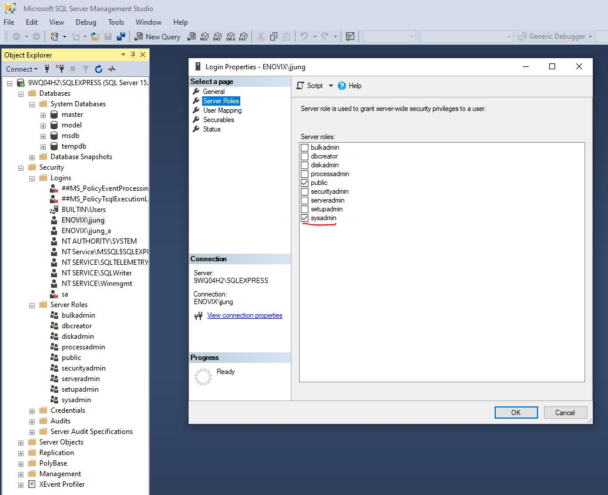

# cda
Crypto Data Analysis

### 1. Steps to install CDA development environment
0. Install a git software. Pick one of followings.
    - Git (http://gitforwindows.org)
    - TortoiseGit (https://tortoisegit.org/download/)
1. In Git Bash, git clone https://github.com/jaegunjung/cda.git
2. Open cmd as an admin and cd to created directory
3. Create the virtual environment.
    - C:\..\cda>python -m venv .venv
4. Activate the virtual environment.
    - C:\..\cda>.venv\Scripts\activate.bat
5. Load the package indicated in requirements.txt.
    - If you run into an error while installing pyodbc because you need to install
   Microsoft Visual C++ 14.0 or greater. The error message shows the url,
   https://visualstudio.microsoft.com/visual-cpp-build-tools/.
   You can download the vs_buildtools and install it.
   Note, there are many options to install, and it is confusing what to install.
   Visit the following url to select the packages you need.
   https://docs.microsoft.com/en-us/answers/questions/136595/error-microsoft-visual-c-140-or-greater-is-require.html
6. Exit the environment.
    - (.venv) C:\..\cda> deactivate

### 2. Prepare Database and tables in the SQL server in development environment
1. Install following software programs to host the MS SQL server.
	- SQL Server Management Studio (https://docs.microsoft.com/en-us/sql/ssms/download-sql-server-management-studio-ssms?view=sql-server-ver15)
	- SQL Server Express (https://www.microsoft.com/en-us/sql-server/sql-server-downloads)
2. Grant sysadmin permissions to yourself on your local SQL Server Express
    - Run SQL Server Management Studio as Administrator
    - Connect to .\sqlexpress
    - Open Security -> Logins
    - Add or edit your non-admin
    - Select server Roles
    - Check the sysadmin role
    - Click Ok.
    - Exit SQL Server Management
    

3. Run scripts in the sql_scripts folder.
    - create_db.sql
    - Crypto_Daily.sql

### 3. Start CDA application via an IDE
0. Install a python IDE software. Pick one of followings.
    - Pycharm (https://www.jetbrains.com/pycharm/download)
    - Visual Studio Code (https://code.visualstudio.com/download)
1. Launch the IDE and open the cda folder. Select the python
   interpreter in the .venv folder.